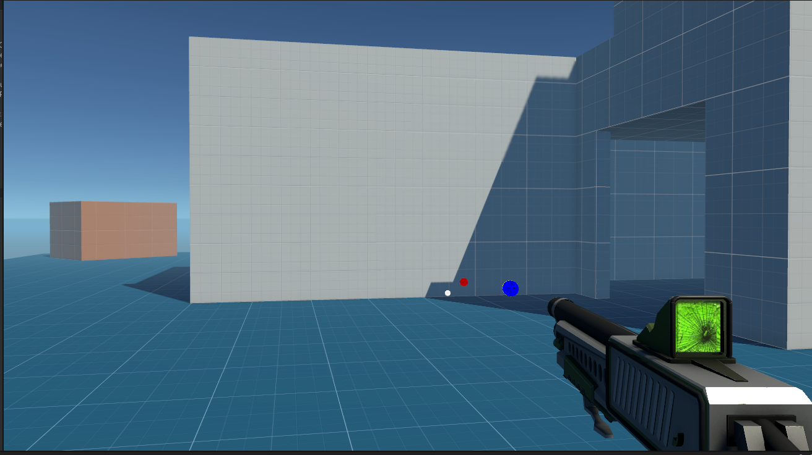
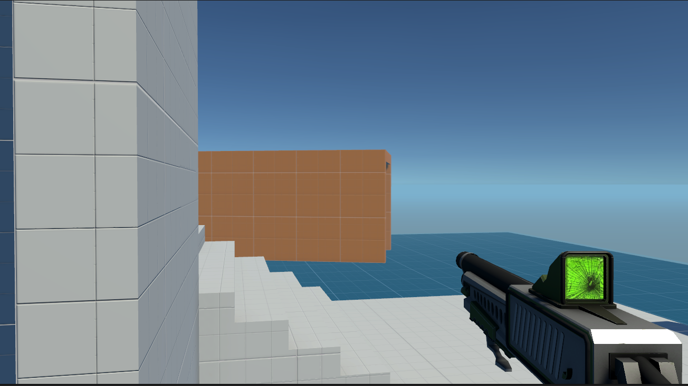

# FPS - First Person Shooter in Unity



## Description

First Person Shooter game developed in Unity. This project serves as a foundation for creating an immersive shooting experience in a 3D environment.

## Features

- First-person camera perspective.
- Player movement and controls.
- Shooting mechanics.
- Enemy AI with basic behaviors.
- Level design showcasing Unity's capabilities.



## Getting Started

### Prerequisites

- Unity Game Engine 

### Installation

1. Clone the repository:

   ```bash
   git clone https://github.com/Alaaeldinn/Fps.git
